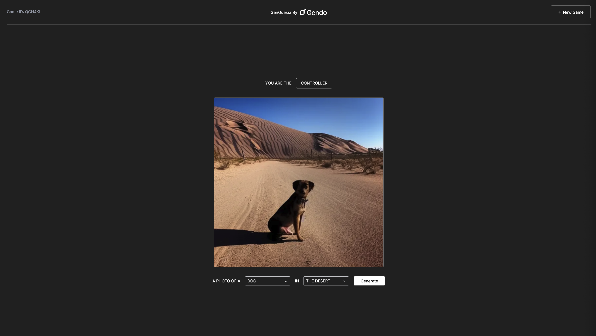

# GenGuessr: Gendo Tech Task

Task instructions can be found [here](https://docs.google.com/document/d/1Sv_0liAbUFcOu9dK0m4UmJfFraB4k9Od4Yt9gnvlTXc/edit?usp=sharing).



This mono-repo consists of two projects: a frontend NextJS application, and a
supporting API backend that uses the NestJS framework (not to be confused with
the frontend framework).

Each project has it's own README:

- [GenGuessr Web](./web/README.md)
- [GenGuessr API](./api/README.md)

## Requirements

- Node (developed using v20.8.0)
- [pnpm](https://pnpm.io/)

## Setup

From the project root, run the following:

```sh
# Install node dependencies
pnpm i

# Set local environment
pnpm run configure

# Run both applications in dev mode
pnpm run dev
```

The web application will then be available at http://localhost:3000 and the API
at http://localhost:3001.

To keep things simple for the task, `pnpm dev` starts both the Next application
**and** the Nest API (with hot reloading). You're welcome to add docker to the
project and run them as two containers, if you'd prefer.

Because pnpm truncates the output from each application to ~10 lines, when
debugging its recommended to run the two applications separately by starting
each with their individual start commands in different terminal windows.

## Websockets

The API has been setup to listen to websocket events. These allow asynchronous
messages to be sent bi-directionally the client and server. A very trivial
example of using the websockets has been implemented with a "ping-pong"
component in the web application. These ping pong events have been left as an
example of websocket usage and **should be removed** once websockets have been
implemented properly within the GenGuessr game.
